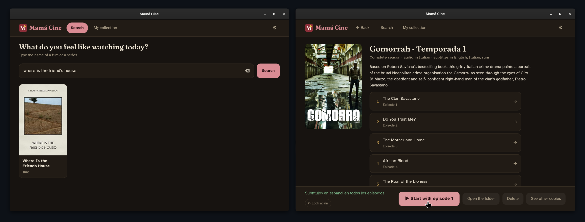
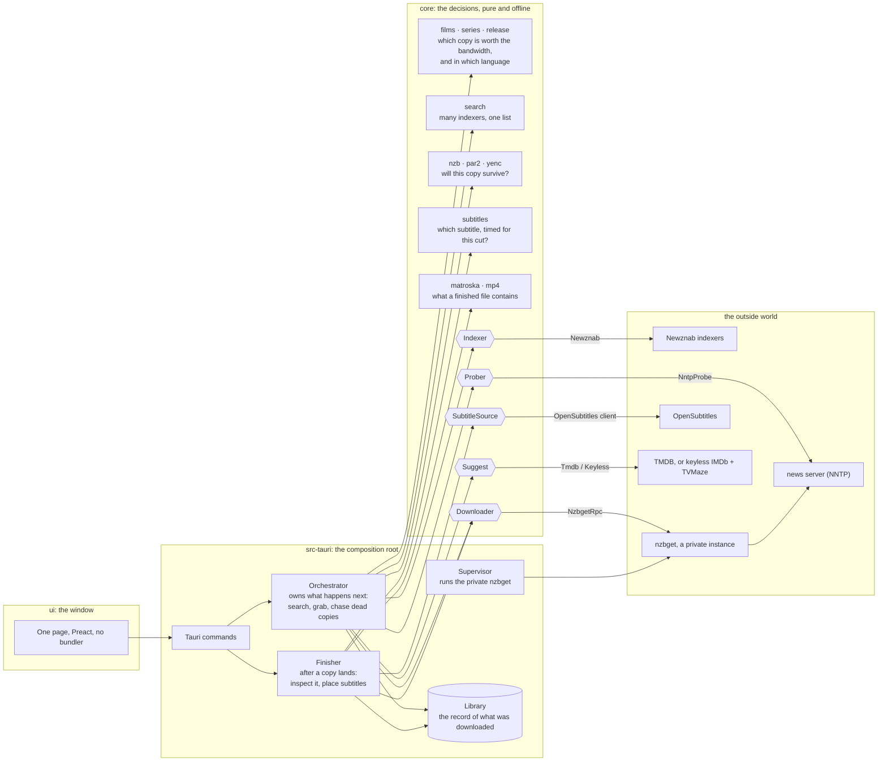

# Mamá Cine

A desktop app for giving a less technical friend or relative a way to use your usenet setup, with none of its complications. You bring the accounts: an indexer, a news server, a subtitles service. The person you set it up for gets a search box, a shelf of posters, and one button that plays the film.

They type a title. The app finds a copy, downloads it, fetches subtitles when the copy has none they can read, and puts it on the shelf. Whole seasons of television work the same way, with an episode list to choose from. Everything else, which of nine copies is worth the bandwidth, whether the repair data is real, what to do when a copy arrives broken, is the app's job, and it is done without asking.



It was built for one person, the author's mother, and that constraint is the design brief: no domain vocabulary on screen, no decision the app could have made itself, failures reported calmly and accurately.

## Languages

The interface speaks **Spanish** and **English**. It follows the computer's language by default (English when the computer speaks something else), and can be set explicitly in Ajustes. Separately, the language of the subtitles it fetches, the film records and the dub-ranking also follows the computer, and can be pinned in the settings file.

## What the person setting it up provides

Accounts are entered once, on the settings screen, and stored under the user's own account. Nothing is compiled in.

- A usenet provider (host, user, password).
- At least one indexer with a Newznab API, such as NZBGeek.
- An [OpenSubtitles](https://www.opensubtitles.com/) key and login, for subtitles.
- Optionally a free [TMDB](https://www.themoviedb.org/) key, which buys titles, synopses and episode names in the user's language. Without it the app falls back to keyless lookups (IMDb for titles, TVMaze for shows) and works with nothing configured.

[nzbget](https://nzbget.com/) does the downloading. It travels with the build, runs as a private instance on its own port with a random control password, and is supervised by the app.

## Platforms

The app runs wherever [Tauri](https://tauri.app/) runs. Builds exist today for Windows (an NSIS installer, cross-compiled from Linux) and Linux (an AppImage); both are reproducible container builds. CI currently runs the checks; published releases are still to come. Installed copies look at GitHub Releases once a day: the AppImage replaces itself in place and starts new on the next launch, and on Windows the app fetches the installer, verifies it, and runs it when asked to.

## Contributing

[Nix](https://nixos.org/) provides the development environment. `nix develop`, then:

```sh
just dev        # the app
just preview    # the interface alone, in a browser, with canned data and no credentials
just check      # fmt, clippy with warnings denied, and every test; the same command CI runs
just release    # the Linux AppImage, built in a pinned container
just windows    # the Windows installer, cross-compiled the same way
```

Releases are built in a pinned container rather than from the flake: a Nix-built binary links against store paths that exist on no other machine.

### How it fits together

Every volatile dependency crosses a trait seam declared in `core`; the real implementations are constructed once, in `src-tauri`'s composition root, over an HTTP client wrapped in a per-host rate floor. Tests substitute fakes at the seams, which is why the whole suite runs offline in seconds.



| Path | What it holds |
| --- | --- |
| `core/` | Every decision, with no interface and no ambient configuration. The tests need no network. |
| `src-tauri/` | The composition root, the orchestrator that owns what happens next, nzbget supervision, the record of what was downloaded, the log. |
| `ui/` | One page, one stylesheet, one script. No bundler, no framework. `preview.html` runs it in an ordinary browser. |
| `scripts/` | Running the app in development, and the two release builds. |

### Adding a translation

Every sentence lives in two catalogs, one per side of the app:

- `src-tauri/src/text.rs` holds everything the backend says (errors, notifications, the tray, the notes on a download's story). Add a variant to `enum Lang` and the compiler names every match that needs the new language; `just check` passes when the translation is complete.
- `ui/app.js` holds everything the window says, in the `STRINGS` object. Add an entry beside `es` and `en`, and a chip for it in the Ajustes screen.

Wire the new code into `Lang::from_code` and the `language_noun` tables, and the app will offer it and follow the computer's locale to it.

`engineering/README.md` is what the code is held to: why configuration is a value rather than an ambient read, why every volatile dependency crosses a seam, and what the app is allowed to say to the person using it. `engineering/notes.md` records what the systems this app depends on actually do: the measured behaviors and workarounds the code is built around.

## License

MIT, in `LICENSE`. The programs the Windows build travels with, nzbget, UnRAR and 7-Zip, have their own licenses, listed in `THIRD-PARTY-NOTICES.md` together with the vendored interface libraries and fonts.
